<h1 align="center">
<picture >
 <source srcset="born-to-learn.avif">
 <source srcset="born-to-learn.webp">
  <!--original image src="https://github-production-user-asset-6210df.s3.amazonaws.com/22438427/259785274-8ff0705a-65dd-4197-81b5-b8ffd2befe0c.png"-->
 
</picture>
</h1>

<h1 align="center"> Akwaaba 👋, I'm ✨ <i>Bernard Assan</i> ✨</h1>
<h3 align="center">Systems Software Engineer | Data Scientist | Cloud Engineer</h3>

  

👨‍💻 I'm a software engineer who loves **Systems Programming**, **Project Management** and **Linux Systems**:

- ⚡ I am interested in **Data Science**, **Cloud Computing**, **Backend Engineering**, **Compiler Development**, and **Graphics & Network Programming**
- 🔭 Currently working on [**Imagination**](https://github.com/bernardassan/imagination), [**Zvips**](https://github.com/bernardassan/zvips), [**Recblock**](https://github.com/bernardassan/recblock), and [**ModernC**](https://github.com/bernardassan/modernc)
- 👯 Looking to collaborate on **Zig**, **Rust**, **C++**,  **C**, **Python** and **Lua** projects. 
- 📫 Reach me [**_@themalpha_**](https://t.me/themalpha) on _telegram_ and [**_@mega.alpha_**](https://discord.com/users/760132467931217921) on _discord_
<!--
- 🌱 I’m currently learning **Data Science** and **Cloud Computing**
- 🔥 I have completed the following *Professional courses*
  - **Meta Database Engineering** [[**Certificate**](https://www.coursera.org/account/accomplishments/specialization/certificate/88ZTRDP6XSGY)]
  - **Google Project Management** [[**Certificate**](https://www.coursera.org/account/accomplishments/specialization/certificate/HN64WJBSVL8F)]
 - 💬 Ask me any question and we might have a laugh/blast 🔥 and learn in the process
 - 📄 Know about my experiences [rebrand.ly/BernardAssan](https://rebrand.ly/BernardAssan)
- and  [website](https://rebrand.ly/BernardAssan)
original web icon image https://github-production-user-asset-6210df.s3.amazonaws.com/22438427/259840447-83e40bf1-07f0-4d59-b60e-ba0d085be735.png
 🤔 I’m looking for help with learning and getting my hands dirty with some interesting **Rust** projects
 -->

## Connect with me

## 🛠️ Languages & Tools

## 🔥 Stats

<!-- https://stackoverflow.com/questions/12090472/how-do-i-center-an-image-in-the-readme-md-file-on-github -->

<picture>
  <!-- <source
    media="(prefers-color-scheme: dark)"
    srcset="https://github-readme-stats.vercel.app/api?username=bernardassan&show_icons=true&theme=dark"
  />
  <source
    media="(prefers-color-scheme: light), (prefers-color-scheme: no-preference)"
    srcset="https://github-readme-stats.vercel.app/api?username=bernardassan&show_icons=true"
  />
 -->
  
</picture>

<picture>
<!--  <source
   media="(prefers-color-scheme: dark)"
   srcset="https://github-readme-stats.vercel.app/api/top-langs?username=bernardassan&langs_count=10&layout=compact&size_weight=0.3&count_weight=0.7&theme=dark&custom_title=Overall%20Language%20Statistics"
  />
  <source
    media="(prefers-color-scheme: light), (prefers-color-scheme: no-preference)"
    srcset="https://github-readme-stats.vercel.app/api/top-langs?username=bernardassan&langs_count=10&layout=compact&size_weight=0.3&count_weight=0.7&custom_title=Overall%20Language%20Statistics"
  />
 -->
  
</picture>

